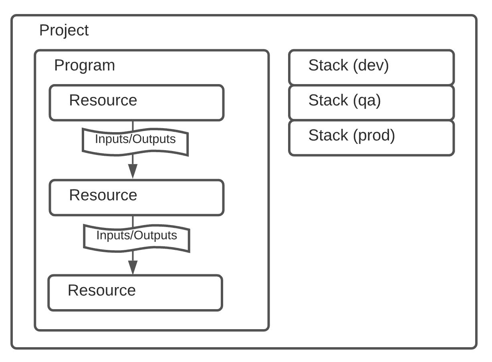
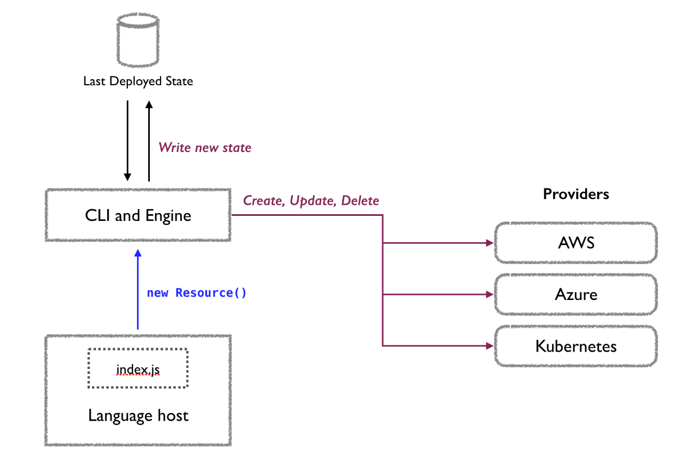

# pulumi-learn

Exercises for learning [pulumi](https://www.pulumi.com/)

## What is Pulumi

### IaC Tool

* Pulumi is an Infrastructure as Code (IaC) tool

### General purpose programming languages vs domain-specific language (DSL)

* A core point of differentiation between Pulumi and other IaC offerings has been the ability to use popular general purpose programming languages 
* TypeScript/JavaScript, Python, Go, C#, Java, and YAML
* and their rich software engineering ecosystems, IDE and test frameworks

### Pulumi CLI

* **CLI** - Primarily driven via the `pulumi` [CLI](https://www.pulumi.com/docs/cli/) but also support a Pulumi Operator

### Pulumi Operator

* Exposes the Pulumi Stack as a first-class Kubernetes API resource
* Use the StackController to drive the updates.
* It allows users to adopt a GitOps workflow

## What I Like

https://www.pulumi.com/blog/pulumi-yaml/#yaml-as-a-compilation-target-and-cue-support

* **Documentation** - The Doc is good
* **Easy things are easy** - [Pulumi Yaml](https://www.pulumi.com/docs/languages-sdks/yaml/) is about as simple as using `kubectl apply` with k8s manifests
* **Headroom** - If your use case is complex Pulumi supports that by allowing you to use a general purpose programming language such as Go, CUE and code reuse via [Pulumi Components](https://www.pulumi.com/docs/concepts/resources/components/) for example
* **Strongly typed configuration** - Pulumi supports [type specifications](https://www.pulumi.com/docs/concepts/config/#strongly-typed-configuration) for configuration, including setting defaults, but it is optional
* **Helm** - Deploying a Helm chart with Pulumi is very straightforward and easy

## What I find interesting

Things I liked but would need to look into in more detail.

* **Secrets Management** - Pulumi can manage [secret values](https://www.pulumi.com/docs/concepts/secrets/)
* **Components** - I would be interested to learn more about [Pulumi Components](https://www.pulumi.com/docs/concepts/resources/components/) and how to share code
* **Pulumi Operator** - I would like to know more about how to implement GitOps via the Pulumi Operator
* **CUE support** - languages that are designed to compile down to YAML/JSON can be used directly with [Pulumi YAML](https://www.pulumi.com/blog/pulumi-yaml/#yaml-as-a-compilation-target-and-cue-support)

## What I Don't Like

### The relationship between Stacks and Projects

The relationship between stacks and projects is such that we need one stack per project, per environment.  Roughly speaking a project is like a Helm Chart and a stack is like a values.yaml file for the target environment.

This [GitHub Issue](https://github.com/pulumi/pulumi/issues/8402) describes the problem well

>Currently, Pulumi maintains a 1:1 relationship between stacks and projects. This means that if I have multiple projects targeting the same "environment", instead of being able to define one stack and one corresponding configuration file; I'm on the hook for one stack per project, per environment.

* You can use the output of one stack as input to other stacks but the I don't see a clean way to deploy multiple projects at once.
* Pulumi does support [Project Level Configuration](https://www.pulumi.com/docs/concepts/config/#project-level-configuration) which allows setting configuration at the project level instead of having to repeat the configuration setting in each stack’s configuration file. But this is per project and does not address the multiple project issue.

We will see this in the `multi-stacks` example. Notice there are multiple `Pulumi.mystack1.yaml` files

```sh
.
├── README.md
├── allUp.sh
├── app1
│   ├── Pulumi.mystack1.yaml
│   ├── Pulumi.yaml
│   ├── go.mod
│   ├── go.sum
│   └── main.go
├── app2
│   ├── Pulumi.mystack1.yaml
│   ├── Pulumi.yaml
│   ├── go.mod
│   ├── go.sum
│   └── main.go
└── infr
    ├── Pulumi.mystack1.yaml
    └── Pulumi.yaml
```

## Pulumi Concepts

### Overview



### How Pulumi works



### Projects

* A [Pulumi project](https://www.pulumi.com/docs/concepts/projects/) is any folder which contains a `Pulumi.yaml`
* A new project can be created with `pulumi new`
* A typical Pulumi.yaml file looks like the following:

```yaml
name: webserver
runtime: nodejs
description: Basic example of an AWS web server accessible over HTTP.
```

### Stacks

* A [stacks](https://www.pulumi.com/docs/concepts/stack/#stacks) is an isolated, independently configurable instance of a Pulumi program. 
* Stacks are commonly used to denote different phases of development (such as `development`, `staging`, and `production`)
* To initilize a new stack

```sh
pulumi stack init staging
```

* A stack can export values as stack outputs. They can be used for important values like resource IDs, computed IP addresses, and DNS names.

### State and Backends

* Each stack has its own state, and state is how Pulumi knows when and how to create, read, delete, or update cloud resources.
* Pulumi supports two classes of state backends for storing your infrastructure state:
  * **Service**: a managed cloud experience using the online or self-hosted Pulumi Cloud application
  * **Self-Managed**: a manually managed object store, including AWS S3, Azure Blob Storage, Google Cloud Storage, any AWS S3 compatible server such as Minio or Ceph, or your local filesystem

* The login command logs you into a backend:

```sh
pulumi login <URL or Path>
```

### Configuration

* Pulumi stores [configuration](https://www.pulumi.com/docs/concepts/config/#configuration) as key-value pairs for each stack in the project stack setting file `Pulumi.<stack-name>.yaml`

```sh
$ pulumi config set name Foo
$ pulumi config get name
Foo
```

Examples in different languages:

yaml

```yaml
config:
  name:
    type: string
  lucky:
    default: 42
  secret:
    type: string
    secret: true
```

Go

```go
package main

import (
    "github.com/pulumi/pulumi/sdk/v3/go/pulumi"
    "github.com/pulumi/pulumi/sdk/v3/go/pulumi/config"
)
func main() {
    pulumi.Run(func(ctx *pulumi.Context) error {
        conf := config.New(ctx, "")
        name := conf.Require("name")
        lucky, err := conf.TryInt("lucky")
        if err != nil {
            lucky = 42
        }
        secret := conf.RequireSecret("secret")
        return nil
    }
}
```

JavaScript

```javascript
let config = new pulumi.Config();
let name = config.require("name");
let lucky = config.getNumber("lucky") || 42;
let secret = config.requireSecret("secret");
```

### Secrets

Pulumi supports encrypting specific values as “[secrets](https://www.pulumi.com/docs/concepts/secrets/)” and stores them in your stack settings file.

In the [stack setting file](https://www.pulumi.com/docs/concepts/projects/#stack-settings-file) section of the doc it says:

>For stacks that are actively developed by multiple members of a team, the recommended practice is to check your stack settings file into source control as a means of collaboration.

We will see this in the `helm2` example

```sh
pulumi config set MY_PASS bla --secret
```

My stack settings file - `Pulumi.dev.yaml`

```yaml
encryptionsalt: v1:GlKk87t1m9k=:v1:jqGSNfyuIt3OgUz9:13FSoA4gn4qBD+OlozIDdbUaNBQcyw==
config:
  helm2:FOO: bar
  helm2:MY_PASS:
    secure: v1:uvdz4bigX4DPchxL:rebKmW2PLMaePdhE/Ye+r/HG5Q==
  helm2:k8sNamespace: helm2ns
```


## Demos

### Install

```sh
brew install pulumi/tap/pulumi
```

### Of Interest

* https://www.pulumi.com/docs/using-pulumi/organizing-projects-stacks/
* [patterns - the centralized platform infrastructure repository](https://www.pulumi.com/blog/organizational-patterns-infra-repo/)
